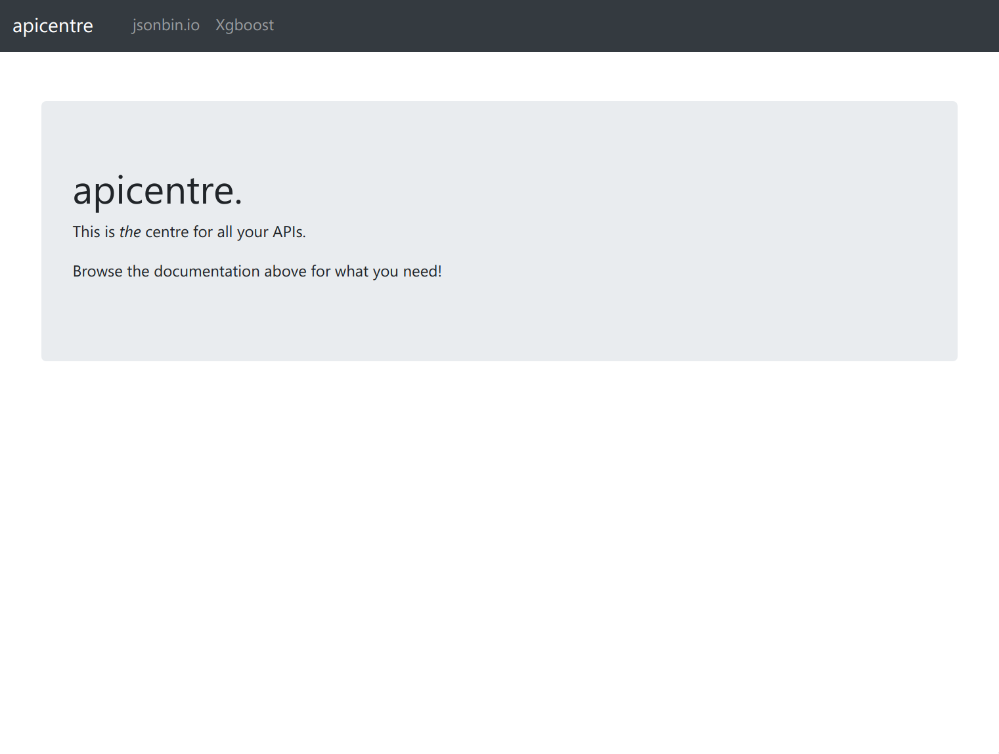

# apicentre

`apicentre` is a place to host api documentation for different apis.

## Motivation

When apis are designed by multiple teams, they would have their own pages documenting their own apis.

It will be really nice to have a single api documentation app where different teams could submit their api documentation or have the api documentation app pull openapi descriptions for rendering, but we could save engineering time by adopting the technique of [micro-frontends](https://martinfowler.com/articles/micro-frontends.html).

`apicentre` implements micro-frontends using iframes.

This trades off coherence in the visual design of apicentre, but allows different teams the flexibility of using different styles of api documentation, as long as they can serve a webpage.

## Preview



## Getting Started

Install dependencies

```
pip install -r requirements.txt
```

Write your links to a yaml file. (Each team should update this file once when they release an api)

```
$ cat sample-links.yml
- path: jsonbin
  label: jsonbin.io
  addr: https://jsonbin.io/api-reference
- path: xgboost
  label: Xgboost
  addr: https://xgboost.readthedocs.io/en/latest/python/python_api.html
$
```

Render the yaml file into `App.js`

```
./apicentre.py sample-links.yml
```

Preview!

```
yarn start
```

## Todo

To try: implement a backend for apicentre to proxy requests, so that the individual teams won't even have to specifically unset the following on their pages

+ `X-Frame-Options: sameorigin`
+ `X-Frame-Options: deny`
